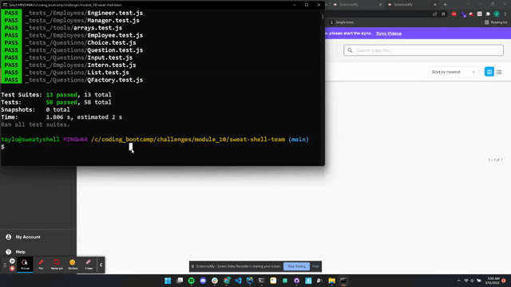
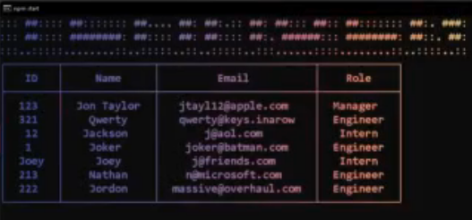
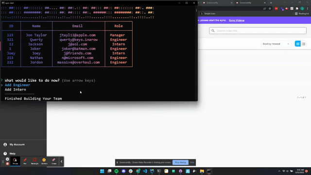
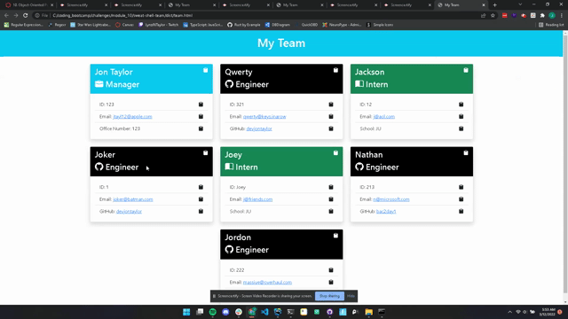

# Team Generator
[](./LICENSE)
[](https://eslint.org)
[](https://jestjs.io)
[](https://nodejs.org/)
[](https://github.com/SBoudrias/Inquirer.js)
[](https://getbootstrap.com/)

## Table Of Contents
* [Description](#description)
* [Roadmap](#roadmap)
* [Installation](#installation)
    * [Dependencies](#dependencies)
    * [Clone](#clone)
    * [Zip](#zip)
* [Running Tests](#running-tests)
    * [Basic](#basic)
    * [Coverage](#coverage)
    * [Verbose](#verbose)
    * [Breakdown](#breakdown)
* [Usage](#usage)
    * [Starting](#starting)
    * [Validation Checks](#validation-checks)
    * [Displays Team](#displays-team)
    * [Chrome Pops Up](#chrome-pops-up)
    * [Copy Employee Data Easily](#copy-employee-data-easily)
* [Lessons](#lessons)
* [Contact Me](#contact-me)
* [License](#license)
## Description
This is a Team Roaster generator.  You build your team, and it generates an HTML file.
The employees will consist of a Manager, Engineer, and Intern.  This will allow a display
of Object-Oriented Programming(OOP) mixed with Unit Testing.  This project was such a
great learning experience.  I learn best when I can break things down and Inquirer and
Jest both allowed me to do this.
## Roadmap
* [x]  Employee Objects (Abstract, Manager, Engineer, Intern)
* [x]  Unit Tests for Employee Classes
* [x]  Inquirer SDK
* [x]  Unit Tests for Inquirer SDK
* [x]  Validation in place for user input
* [x]  App runs until user is finished
* [x]  HTML Page is generated
* [x]  Copy buttons attached to Employee sections
* [x]  HTML file opens in chrome automatically when finished.
## Installation
You will need to have Nodejs installed along with Node Package Manager(NPM)  You can
find some links below on how to install Node and NPM on Windows, Linux, and macOS.
### Dependencies
[](https://nodejs.org/en/download/)
* [How to Install Node.js and NPM on Windows - phoenixNAP](https://phoenixnap.com/kb/install-node-js-npm-on-windows)
* [How to install Node.js and npm on macOS - newline](https://www.newline.co/@Adele/how-to-install-nodejs-and-npm-on-macos--22782681)
* [How To Install Node.js on Ubuntu 20.04 - DigitalOcean](https://www.digitalocean.com/community/tutorials/how-to-install-node-js-on-ubuntu-20-04)
### Clone
Assuming you have Node and NPM you can clone this GitHub repo, go into the directory,
and install the package.json file with NPM.
```bash
git clone https://github.com/DevJonTaylor/sweaty-shell-team.git
cd sweaty-shell-team
npm install
```
### Zip
Another method is to download the zip file, unzip the contents to a specific directory
and install the package.json file.

These commands that work on all three. (Windows, macOS, Linux) assuming they have
curl & tar.  Which newer version of Windows have.
```bash
curl -o team_gen.zip https://github.com/DevJonTaylor/sweaty-shell-team/archive/refs/heads/main.zip
tar -xf team_gen.zip
cd sweaty-shell-team-main
npm install
```


## Running Tests

I have set up unit tests on the common tools (numbers, arrays, typeChecks, and strings),
Question SDK that I set up to work with Inquirer (Question, Input, List, Choice, and QFactory),
and the Employee classes (Employee, Manager, Engineer, and Intern).

To run tests, run the following commands from the root of the application.

### Basic
```bash
npm test
```

### Coverage
```bash
npx jest --coverage
```

### Verbose
```bash
npx jest --verbose
```

### Breakdown
```bash
PASS  _tests_/tools/arrays.test.js
  Library > Tools > Arrays
    √ randomNode function (3 ms)

 PASS  _tests_/tools/strings.test.js
  Library > Tools > Strings
    √ camelCase function (3 ms)
    √ capitalize function
    √ isEmpty function (1 ms)

 PASS  _tests_/Employees/Manager.test.js
  Manager Class
    √ Manages get and set office number method. (2 ms)
    √ Manages get role method. (1 ms)
    √ Managers toString method (1 ms)
    √ getter basicObject (1 ms)

 PASS  _tests_/Questions/Input.test.js
  Input Class
    √ Instantiate (3 ms)

 PASS  _tests_/tools/typeChecks.test.js
  Library > Tools > typeChecks
    √ isUndefined function (3 ms)
    √ isString function (2 ms)
    √ isFunction function (1 ms)

 PASS  _tests_/Employees/Employee.test.js
  Employee Class
    √ Employees set and get name. (2 ms)
    √ Employees set and get email.
    √ Employees set and get id. (1 ms)
    √ Employees getRole method.
    √ Employees toString method (1 ms)
    √ getCopyIcon function (2 ms)
    √ getAnchor function

 PASS  _tests_/Questions/Question.test.js
  Question Class
    √ Instantiate (3 ms)
    √ message method (1 ms)
    √ default method
    √ validate method
    √ getter validateEmpty (1 ms)
    √ getter isDefault (1 ms)
    √ getter isValidate
    √ getter validate Email (2 ms)
    √ getter toObject

 PASS  _tests_/tools/numbers.test.js
  Library > Tools > Numbers
    √ randomNumber function (3 ms)

 PASS  _tests_/Questions/Choice.test.js
  Choice Class
    √ Instantiate (3 ms)
    √ name method
    √ value method (1 ms)
    √ key method
    √ getter checked & isChecked (1 ms)
    √ getter disabled & isDisabled
    √ getter toObject

 PASS  _tests_/Employees/Intern.test.js
  Intern Class
    √ Interns get and set methods for github. (4 ms)
    √ Interns getRole method.
    √ Employees toString method
    √ getter basicObject (1 ms)

 PASS  _tests_/Employees/Engineer.test.js
  Engineer Class
    √ Engineers get and set methods for github. (3 ms)
    √ Engineers getRole method. (1 ms)
    √ Engineers toString method.
    √ getter basicObject (1 ms)

 PASS  _tests_/Questions/List.test.js
  List Class
    √ Instantiate (1 ms)
    √ newChoice, hasChoice, getChoice, and removeChoice method (1 ms)
    √ newChoices method
    √ pageSize method
    √ addSeparator method
    √ getter highlight (1 ms)
    √ getter loop
    √ getter toObject (1 ms)

 PASS  _tests_/Questions/QFactory.test.js
  QFactory class
    √ input method (1 ms)
    √ list method
    √ hasQuestion method (1 ms)
    √ getQuestion method
    √ getter toObject (1 ms)
    √ getter answers (1 ms)

----------------------|---------|----------|---------|---------|-------------------
File                  | % Stmts | % Branch | % Funcs | % Lines | Uncovered Line #s
----------------------|---------|----------|---------|---------|-------------------
All files             |   95.55 |    89.47 |    95.6 |   98.74 |
 _tests_              |     100 |     87.5 |     100 |     100 |
  tools.js            |     100 |     87.5 |     100 |     100 | 2
 lib/tools/arrays     |     100 |      100 |     100 |     100 |
  index.js            |     100 |      100 |     100 |     100 |
  randomNode.js       |     100 |      100 |     100 |     100 |
 lib/tools/numbers    |     100 |      100 |     100 |     100 |
  index.js            |     100 |      100 |     100 |     100 |
  random.js           |     100 |      100 |     100 |     100 |
 lib/tools/strings    |     100 |      100 |     100 |     100 |
  camelCase.js        |     100 |      100 |     100 |     100 |
  capitalize.js       |     100 |      100 |     100 |     100 |
  index.js            |     100 |      100 |     100 |     100 |
  isEmpty.js          |     100 |      100 |     100 |     100 |
 lib/tools/typeChecks |     100 |      100 |     100 |     100 |
  index.js            |     100 |      100 |     100 |     100 |
  isFunction.js       |     100 |      100 |     100 |     100 |
  isString.js         |     100 |      100 |     100 |     100 |
  isUndefined.js      |     100 |      100 |     100 |     100 |
 src/Employees        |     100 |      100 |     100 |     100 |
  Employee.js         |     100 |      100 |     100 |     100 |
  Engineer.js         |     100 |      100 |     100 |     100 |
  Intern.js           |     100 |      100 |     100 |     100 |
  Manager.js          |     100 |      100 |     100 |     100 |
 src/Questions        |   92.94 |    84.74 |   91.66 |   97.88 |
  Choice.js           |   95.12 |    89.47 |     100 |     100 | 24,130
  Input.js            |     100 |      100 |     100 |     100 |
  List.js             |   97.95 |       90 |     100 |     100 | 105
  QFactory.js         |   85.71 |       90 |   69.23 |   89.65 | 32,110-118
  Question.js         |   90.24 |       75 |     100 |     100 | 29,79-93,139-140
  index.js            |     100 |      100 |     100 |     100 |
----------------------|---------|----------|---------|---------|-------------------

Test Suites: 13 passed, 13 total
Tests:       58 passed, 58 total
```

## Usage

You can watch usage of this application [here](https://www.youtube.com/watch?v=OZJ9TPRHF4E)

### Starting
```bash
npm start
```


### Validation Checks
* Duplicate Employee IDs
* Email Validation
* Office Number Validation
* Empty Inputs


### Displays Team


### Chrome Pops Up
* Chrome opens when file is done
* The application also prompts with a check and file location.
  
  

### Copy Employee Data Easily



## Lessons

### First time working with Inquirer
Generally when it is the first time I work with an API I'll build my own wrapper.  This
was really beneficial because it allowed me to dig really deep.

### First time working with Jest
What I did to overcome/how it was helpful...


## Contact Me

- **Phone/SMS**: [(512)740-9784](tel:+15127409784/)
- **Email**: [jonnytest1101@icloud.com](mailto:jonnytest1101@icloud.com)
- **GitHub**: [@DevJonTaylor](https://www.github.com/devjontaylor)
- **LinkedIn**: [Vue-Shell](https://www.linkedin.com/in/vue-shell)


## License

[](https://github.com/DevJonTaylor/sweaty-shell-team/blob/main/LICENSE)

